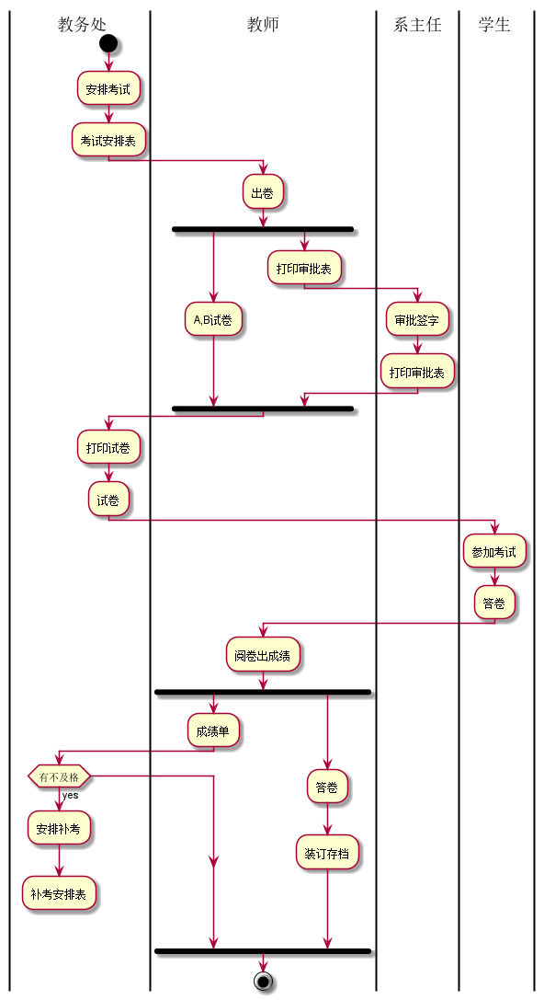
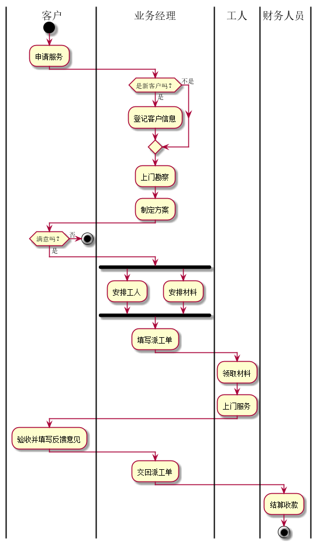

# is_analysis
|学号|班级|姓名|照片|
|:-------:|:-------------: | :----------:|:---:|
|201610414421|软件(本)16-4|王宇||


##流程图1：期末考试流程
**PlantUML源码如下：**

``` flow1
@startuml
|教务处|
start
:安排考试;
:考试安排表;
|教师|
:出卷;
fork
	:A,B试卷;
  fork again
	:打印审批表;
	|系主任|
	:审批签字;
	:打印审批表;
  end fork
 |教务处|
:打印试卷;
:试卷;
|学生|
:参加考试;
:答卷;
|教师|
:阅卷出成绩;
fork
	:成绩单;
	|教务处|
	if (有不及格) then (yes)
      :安排补考;
      :补考安排表;
      detach
    else
    endif
    fork again
    |教师|
    :答卷;
    :装订存档;
    end fork
stop
@enduml
```

**业务流程图如下：**



**流程说明**
期末考试前，教务处负责安排全校课程的考试时间和地点，下发“考试安排表”。考试前一周，各个老师出好A,B两份试卷，
填写“打印试卷审批表”一并交给系主任审批签字。然后送交教务处打印试卷。后让学生参加考试，考试完毕后教师评阅试卷并打出成绩单
并对学生答卷装订存档。如果课程有不合格的情况，教务处负责安排补考，产生“补考安排表”，流程结束。

## 流程图2： 客户维修服务流程

**PlantUML源码如下：**

``` flow2
@startuml
|客户|
start
:申请服务;
|业务经理|
if (是新客户吗？) then (是)
      :登记客户信息;
    else(不是)
    endif
    :上门勘察;
    :制定方案;
|客户|
if (满意吗？) then (是)
      :签订服务合同;
      else(否)
      stop
     endif
|业务经理|
   fork
   	:安排工人;
     fork again
   	:安排材料;
     end fork
     :填写派工单;
     |工人|
     :领取材料;
     :上门服务;
     |客户|
     :验收并填写反馈意见;
     |业务经理|
     :交回派工单;
     |财务人员|
     :结算收款;
     stop
@enduml
```

**业务流程图如下：**




**流程说明**
流程从客户申请服务开始，如果是新客户，业务经理将该客户的基本信息记录下来。接下来业务经理将上门进行勘察，
并制定具体“维修方案”。业务经理和客户就方案进行沟通，如果达成一致，则签订“服务合同”，否则流程结束。根据
合同方案，业务经理将对实施维修的人员和所需材料进行计划，并填发“派工单”。工人拿到派工单后，领取指定材料
上门服务。服务完成后，客户验收并在“派工单”上填写维修信息和反馈意见。业务经理收回派工单后，通知财务人员进行
项目的结算并收款，流程终结。