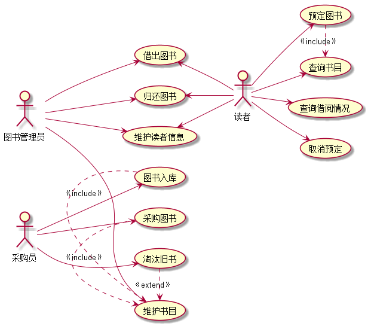
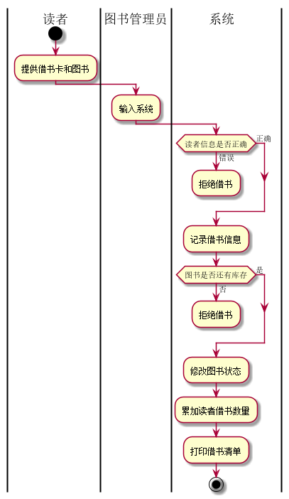
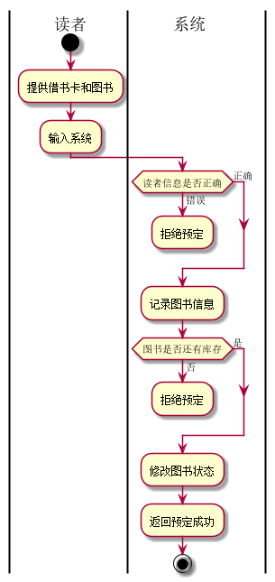

## 1. 图书管理系统的用例关系图

### 1.1 用例图PlantUML源码如下：

``` 用例图
@startuml
 left to right direction
 :图书管理员: --> (借出图书)
 :图书管理员: --> (归还图书)
 :图书管理员: --> (维护书目)
 :图书管理员: --> (维护读者信息)
 :读者: --> (查询借阅情况)
 :读者: --> (查询书目)
 :读者: --> (预定图书)
 :读者: --> (取消预定)
 (借出图书) <-- :读者:
 (归还图书) <-- :读者:
 (维护读者信息) <-- :读者:
 :采购员: --> (采购图书)
 :采购员: --> (图书入库)
 :采购员: --> (淘汰旧书)
 (预定图书).>(查询书目):《include》
 (图书入库).>(维护书目):《include》
 (采购图书).>(维护书目):《include》
 (淘汰旧书).>(维护书目):《extend》
 @enduml

```


### 1.2. 用例图如下：



## 2. 参与者说明：

###     2.1 图书管理员

主要职责是：与读者进行交互，对读者借书、还书进行处理，同时对图书进行日常维护，和对读者信息进行管理。

###     2.2 读者

主要职责是：能从图书馆进行借书和还书，同时还能预定或取消预定图书。

###     2.3 采购员
    
主要职责是：根据图书馆的实际情况，去订购图书并把图书有序放入图书馆，同时把不能用的图书更换，淘汰。

##     3. 用例规约表

###     3.1 “借出图书”用例
<table>
<tr><td colspan="2">用例名称 ： 借出图书</td></tr>
<tr ><td colspan="2">参与者 ： 图书管理员、读者</td></td>
<tr><td colspan="2">前置条件 ： 图书管理员已被识别和授权</td></tr>
<tr><td colspan="2">后置条件 ： 存储借书记录，更新库存数量，所借图书状态为借出</td></tr>
<tr><td colspan="2">主流事件：</td></tr>
<tr>
<td>参与者动作</td>
<td>系统行为</td>
</tr>
<tr>
<td>
1.图书管理员将读者借书卡提供给系统；<br>
3.图书管理员将读者所借图书输入系统；<br>
</td>
<td>

2.系统验证读者身份和借书条件；<br>
4.系统记录图书信息，并修改图书的状态和此书的可借数量；<br>
5.系统累加读者借书数量；<br>
6.系统打印借书清单，交易成功完成；<br>
</td>
</tr>
<tr><td colspan="2">备注事件流</td></tr>
<tr><td colspan="2">

2a.读者信息错误
   1. 系统拒绝借书
   
4a.图书无库存
   1. 系统提示图书以借完，重选图书返回第3步
   
</td></tr>
<tr><td colspan="2">业务规则</td></tr>
<tr><td colspan="2">

1. 每个读者一次最多借5本书。
2. 要等读者把上一次所借图书归还后才能再一次借书。
</td></tr>
</table>

**“借书图书”用例流程图源码如下：**
``` uc1_flow
@startuml
|读者|
start
:提供借书卡和图书;
|图书管理员|
:输入系统;
|系统|
if (读者信息是否正确) then (错误)
      :拒绝借书;
      detach
    else(正确)
    endif
:记录借书信息;
if (图书是否还有库存) then (否)
      :拒绝借书;
      detach
    else(是)
    endif
:修改图书状态;
:累加读者借书数量;
:打印借书清单;
stop
@enduml
```

**“借出图书”业务流程图如下：**



###     3.2 “归还图书”用例

<table>
<tr><td colspan="2">用例名称 ： 归还图书</td></tr>
<tr ><td colspan="2">参与者 ： 图书管理员、读者</td></td>
<tr><td colspan="2">前置条件 ： 图书管理员已被识别和授权</td></tr>
<tr><td colspan="2">后置条件 ： 存储还书记录，更新库存数量，所借图书状态为可借</td></tr>
<tr><td colspan="2">主流事件：</td></tr>
<tr>
<td>参与者动作</td>
<td>系统行为</td>
</tr>
<tr>
<td>

1. 图书管理员将图书提供给系统；
</td>
<td>

2. 系统根据借书记录验证图书记录；
3. 系统提供借阅该书的读者信息；
4. 系统修改借书记录，更新该书的状态及此种书的可借数量；
</td>
</tr>
<tr><td colspan="2">备注事件流</td></tr>
<tr><td colspan="2">

2a.读者信息错误
   1. 系统拒绝还书
   
</td></tr>
<tr><td colspan="2">业务规则</td></tr>
<tr><td colspan="2">
1.必须持有效证件还书。
</td></tr>
</table>


###     3.3 “维护书目”用例

<table>
<tr><td colspan="2">用例名称 ：维护书目</td></tr>
<tr ><td colspan="2">参与者 ： 图书管理员</td></td>
<tr><td colspan="2">前置条件 ： 图书管理员已被识别和授权</td></tr>
<tr><td colspan="2">后置条件 ： 图书进行了整理</td></tr>
<tr><td colspan="2">主流事件：</td></tr>
<tr>
<td>参与者动作</td>
<td>系统行为</td>
</tr>
<tr>
<td>
2.图书管理员根据在库图书清点现有图书；<br>
3.图书管理员根据在库情况和需求通知采购员更新或淘汰图书<br>
</td>
<td>
1.系统提供在库图书的数量；<br>
</td>
</tr>
<tr><td colspan="2">备注事件流</td></tr>
<tr><td colspan="2">

2a.在库情况和现有图书不符合
   1. 管理员查明原因
   
</td></tr>
<tr><td colspan="2">业务规则</td></tr>
<tr><td colspan="2">
1.一周至少要维护一次图书
</td></tr>
</table>

###     3.4 “维护读者信息”用例

<table>
<tr><td colspan="2">用例名称 ：维护读者信息</td></tr>
<tr ><td colspan="2">参与者 ： 图书管理员、读者</td></td>
<tr><td colspan="2">前置条件 ： 图书管理员已被识别和授权</td></tr>
<tr><td colspan="2">后置条件 ： 对读者的信息进行了更新</td></tr>
<tr><td colspan="2">主流事件：</td></tr>
<tr>
<td>参与者动作</td>
<td>系统行为</td>
</tr>
<tr>
<td>
1.读者提供证件找管理员更改信息；<br>
2.图书管理员根据读者需求录入系统<br>
</td>
<td>
3.系统对读者信息进行更改；<br>
</td>
</tr>
<tr><td colspan="2">备注事件流</td></tr>
<tr><td colspan="2">

1a.提供证件和本人不符
   1. 不能更改
   
</td></tr>
<tr><td colspan="2">业务规则</td></tr>
<tr><td colspan="2">
1.更改信息必须本人出面，并携带本人证件
</td></tr>
</table>

###     3.5 “预定图书”用例

<table>
<tr><td colspan="2">用例名称 ：预定书目</td></tr>
<tr ><td colspan="2">参与者 ： 读者</td></td>
<tr><td colspan="2">前置条件 ： 读者已被识别和授权</td></tr>
<tr><td colspan="2">后置条件 ： 读者成功预定了图书</td></tr>
<tr><td colspan="2">主流事件：</td></tr>
<tr>
<td>参与者动作</td>
<td>系统行为</td>
</tr>
<tr>
<td>
1.读者提供自身信息和图书信息；<br>
</td>
<td>
2.系统对读者提供的信息进行验证；<br>
3.系统根据信息更改把图书改为已预订；<br>

</td>
</tr>
<tr><td colspan="2">备注事件流</td></tr>
<tr><td colspan="2">

2a.读者信息验证失败
   1. 不能预定
   
</td></tr>
<tr><td colspan="2">业务规则</td></tr>
<tr><td colspan="2">
1.预定图书必须在3天内来取书，不然自动取消预定
</td></tr>
</table>

**“预定图书”用例流程图源码如下：**
``` 预定图书
@startuml
|读者|
start
:提供借书卡和图书;
:输入系统;
|系统|
if (读者信息是否正确) then (错误)
      :拒绝预定;
      detach
    else(正确)
    endif
:记录图书信息;
if (图书是否还有库存) then (否)
      :拒绝预定;
      detach
    else(是)
    endif
:修改图书状态;
:返回预定成功;
stop
@enduml
```

**“预定图书”业务流程图如下：**



###     3.6 “取消预定”用例

<table>
<tr><td colspan="2">用例名称 ：取消预定</td></tr>
<tr ><td colspan="2">参与者 ： 读者</td></td>
<tr><td colspan="2">前置条件 ： 读者已被识别和授权</td></tr>
<tr><td colspan="2">后置条件 ： 读者成功取消了预定图书</td></tr>
<tr><td colspan="2">主流事件：</td></tr>
<tr>
<td>参与者动作</td>
<td>系统行为</td>
</tr>
<tr>
<td>
1.读者提供自身信息和图书信息；<br>
</td>
<td>
2.系统对读者提供的信息进行验证；<br>
3.系统根据信息更改把图书改为无预订；<br>

</td>
</tr>
<tr><td colspan="2">备注事件流</td></tr>
<tr><td colspan="2">

2a.读者信息验证失败
   1. 不能取消预定
   
</td></tr>
<tr><td colspan="2">业务规则</td></tr>
<tr><td colspan="2">
1.读者可以随时取消预定
</td></tr>
</table>

###     3.7 “查询书目”用例

<table>
<tr><td colspan="2">用例名称 ：查询书目</td></tr>
<tr ><td colspan="2">参与者 ： 读者</td></td>
<tr><td colspan="2">前置条件 ： 读者已被识别和授权</td></tr>
<tr><td colspan="2">后置条件 ： 读者成功查询到了图书</td></tr>
<tr><td colspan="2">主流事件：</td></tr>
<tr>
<td>参与者动作</td>
<td>系统行为</td>
</tr>
<tr>
<td>
1.读者提供图书信息；<br>
</td>
<td>
2.系统对读者提供的信息进行验证；<br>
3.系统根据图书信息把图书在库情况显示给读者；<br>

</td>
</tr>
<tr><td colspan="2">备注事件流</td></tr>
<tr><td colspan="2">

1a.图书信息提错误
   1. 查询不到图书
   
</td></tr>
<tr><td colspan="2">业务规则</td></tr>
<tr><td colspan="2">
1.读者可以在线随时查询图书在库情况
</td></tr>
</table>

###     3.8 “查询借阅情况”用例

<table>
<tr><td colspan="2">用例名称 ：查询借阅情况</td></tr>
<tr ><td colspan="2">参与者 ： 读者</td></td>
<tr><td colspan="2">前置条件 ： 读者已被识别和授权</td></tr>
<tr><td colspan="2">后置条件 ： 读者成功查询到了自身借阅情况</td></tr>
<tr><td colspan="2">主流事件：</td></tr>
<tr>
<td>参与者动作</td>
<td>系统行为</td>
</tr>
<tr>
<td>
1.读者提供自身信息；<br>
</td>
<td>
2.系统对读者提供的信息进行验证；<br>
3.系统根据读者信息把读者借阅情况显示给读者；<br>

</td>
</tr>
<tr><td colspan="2">备注事件流</td></tr>
<tr><td colspan="2">

1a.读者信息提供错误
   1. 拒绝查询
   
</td></tr>
<tr><td colspan="2">业务规则</td></tr>
<tr><td colspan="2">
1.读者可以在线随时查询自身借阅情况。
</td></tr>
</table>

###     3.9 “采购图书”用例

<table>
<tr><td colspan="2">用例名称 ：采购图书</td></tr>
<tr ><td colspan="2">参与者 ： 采购人</td></td>
<tr><td colspan="2">前置条件 ： 图书管理员提供购买清单</td></tr>
<tr><td colspan="2">后置条件 ： 图书采购完成</td></tr>
<tr><td colspan="2">主流事件：</td></tr>
<tr>
<td>参与者动作</td>
<td>系统行为</td>
</tr>
<tr>
<td>
1.图书管理员提供采购清单；<br>
3.采购人根据清单向供应商采购；<br>
4.采购人清点采购的图书
</td>
<td>
2.系统打印出采购清单；<br>
5.将实际采购图书录入系统

</td>
</tr>
<tr><td colspan="2">备注事件流</td></tr>
<tr><td colspan="2">

3a.需要采购的图书不足
   1. 等待供应商提供图书，下次采购。
   
</td></tr>
<tr><td colspan="2">业务规则</td></tr>
<tr><td colspan="2">
1.采购需要在10天内采购完成。<br>
2.采购人必须要根据清单采购。<br>
</td></tr>
</table>


###     3.10 “图书入库”用例

<table>
<tr><td colspan="2">用例名称 ：图书入库</td></tr>
<tr ><td colspan="2">参与者 ： 采购人</td></td>
<tr><td colspan="2">前置条件 ： 成功采购图书</td></tr>
<tr><td colspan="2">后置条件 ： 图书搬入图书馆并录入系统</td></tr>
<tr><td colspan="2">主流事件：</td></tr>
<tr>
<td>参与者动作</td>
<td>系统行为</td>
</tr>
<tr>
<td>
1.采购人将图书搬入图书馆；<br>
4.采购人将实际入库图书与系统提供信息进行对比；<br>
</td>
<td>
2.将图书数量与信息录入系统；<br>
3.系统提供总共入库的图书信息；<br>

</td>
</tr>
<tr><td colspan="2">备注事件流</td></tr>
<tr><td colspan="2">

4a.系统图书信息与实际入库数不符合
   1. 再次清点实际入库数，以实际入库数为准。
   
</td></tr>
<tr><td colspan="2">业务规则</td></tr>
<tr><td colspan="2">
1.入库要核对入库图书信息。<br>
</td></tr>
</table>


###     3.11 “淘汰旧书”用例

<table>
<tr><td colspan="2">用例名称 ：淘汰旧书</td></tr>
<tr ><td colspan="2">参与者 ： 采购人</td></td>
<tr><td colspan="2">前置条件 ： 图书管理员维护图书后确定淘汰图书</td></tr>
<tr><td colspan="2">后置条件 ： 图书淘汰完成</td></tr>
<tr><td colspan="2">主流事件：</td></tr>
<tr>
<td>参与者动作</td>
<td>系统行为</td>
</tr>
<tr>
<td>
1.图书管理员提供淘汰图书清单；<br>
3.采购人根据淘汰图书清单淘汰图书；<br>
</td>
<td>
2.系统打印出淘汰图书清单；<br>
4.将淘汰完成的图书录入系统；<br>

</td>
</tr>
<tr><td colspan="2">备注事件流</td></tr>
<tr><td colspan="2">

4a.淘汰图书与实际淘汰数量不符
   1. 再次清点淘汰数，以实际淘汰数为准。
   
</td></tr>
<tr><td colspan="2">业务规则</td></tr>
<tr><td colspan="2">
1.淘汰图书时要核对淘汰图书信息。<br>
</td></tr>
</table>