## 1. 图书管理系统的类图

### 1.1 类图PlantUML源码如下：

``` class
@startuml
读者"1"--"*"预订记录
读者--借书记录
图书管理员"1"--"*"借书记录 : 登记
预订记录"*"--"1"图书品种 : 被预定
借书记录"0..1"--"1"资源项
资源项"*"--*"1"图书品种
馆藏目录"1"--"1..*"图书品种
采购员"1"-"*"图书管理记录
图书管理员"1"--"*"图书管理记录 : 审核
购买图书--|>图书管理记录
淘汰图书--|>图书管理记录

class  馆藏目录{
}

class 资源项{
    馆藏流水号
    状态
}

class  读者{
    姓名
    身份证号
    借书卡号
    联系方式
    图书限额
    以借图书数
}
class  图书管理员{
    职工号
    姓名
    联系方式
}

class  采购员{
    职工号
    姓名
    联系方式
}

class 预订记录 {
    预定日期
    预订人
}

class 图书品种{
    作者
    出版社
    出版日期
    馆藏数量
    可借数量
}

class  借书记录{
    借书日期
    归还日期
}

class  图书管理记录{
    管理日期
    管理人员名字
    管理人员职工号
}

class 购买图书{
    购买日期
    图书数量
    图书品种
}

class 淘汰图书{
    淘汰日期
    图书数量
    图书品种
}

@enduml
```

### 1.2. 类图如下：

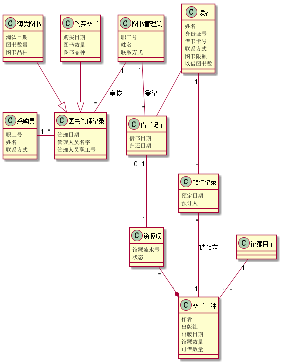

### 1.3. 类图说明：
1. 读者类包括读者的一些基本身份信息、借书数量和借书额度，其主要操作是借书、还书、和预定书籍。<br>
2. 图书管理员类包括姓名和职工编号，主要功能是对读者借书和还书进行登记，同时对图书进行管理。<br>
3. 采购员类包括姓名和职工编号，主要功能是对图书进行淘汰和购买。<br>
4. 预定记录类包括读者预定图书时间和图书品种。<br>
5. 图书品种类包括图书的基本信息，其包含资源项类，功能是记录图书信息。<br>
6. 借书记录类包括借书时间，和还书时间等属性。<br>
7. 图书管理记录包括管理人员姓名、管理人员职工号、和管理日期等属性，其包括购买图书和淘汰图书两个类。<br>
## 2. 图书管理系统的对象图
### 2.1 类读者的对象图
#### 源码如下：
``` class
object 读者{
     姓名 = 张宝
     身份证号 = 501921185756855545
     借书卡号 = 2017051444
     联系方式 = 15889838685
     图书限额 = 20
     以借图书数 = 5
}
``` 
#### 对象图如下：
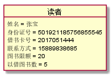

### 2.2 类图书管理员的对象图
#### 源码如下：
``` class
@startuml
object  图书管理员{
     职工号 = 08259544
     姓名 = 刘德华   
     联系方式 = 15882504801
}
@enduml
``` 
#### 对象图如下：

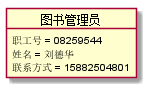

### 2.3 类采购员的对象图
#### 源码如下：
``` class
@startuml
object  采购员{
    职工号 = 08259527
    姓名 = 张学友
    联系方式 = 15889887745
}
@enduml
``` 
#### 对象图如下：

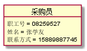

### 2.4 类预订记录的对象图
#### 源码如下：
``` class
@startuml
object 预订记录 {
    预定日期 = 2016.05.11
    预订人 = 郭富城
}
@enduml
``` 
#### 对象图如下：

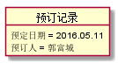

### 2.5 类图书品种的对象图
#### 源码如下：
``` class
@startuml
object 图书品种{
    作者 = 黎明
    出版社 = 成都大学出版社
    出版日期 = 2016.11.12
    馆藏数量 = 45
    可借数量 = 30
}
@enduml
``` 
#### 对象图如下：

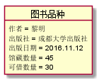

### 2.6 类借书记录的对象图
#### 源码如下：
``` class
@startuml
object  借书记录{
    借书日期 = 2016.05.16
    归还日期 = 2016.06.11
}
@enduml
``` 
#### 对象图如下：

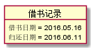

### 2.7 类图书管理记录的对象图
#### 源码如下：
``` class
@startuml
object  图书管理记录{
    管理日期 = 2016.06.17
    管理人员名字 = 刘德华
    管理人员职工号 = 08259577
}
@enduml
``` 
#### 对象图如下：

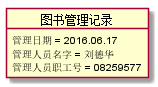

### 2.8 类购买图书的对象图
#### 源码如下：
``` class
@startuml
object 购买图书{
    购买日期 = 2016.06.01
    图书数量 = 10
    图书品种 = 演员的自我修养
}
@enduml
``` 
#### 对象图如下：

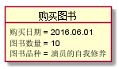

### 2.9 类淘汰图书的对象图
#### 源码如下：
``` class
@startuml
object 淘汰图书{
    淘汰日期 = 2016.04.11
    图书数量 = 15
    图书品种 = 计算机网络
}
@enduml
``` 
#### 对象图如下：

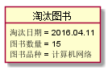

### 2.10 类资源项的对象图
#### 源码如下：
``` class
@startuml
object 资源项{
    馆藏流水号 = 2016051444
    状态 = 借出
}
@enduml
``` 
#### 对象图如下：

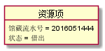