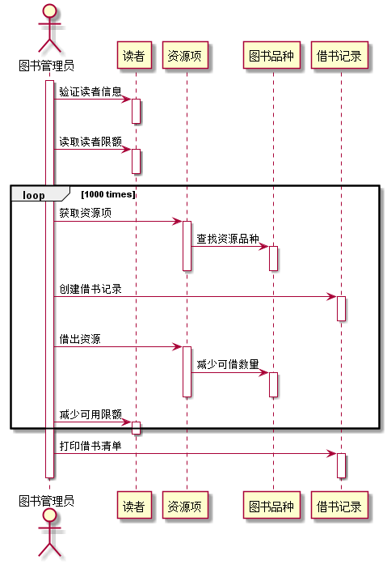
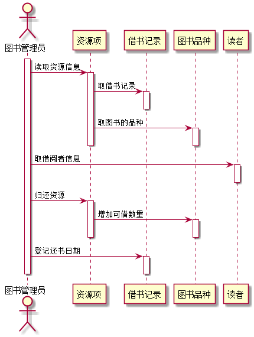
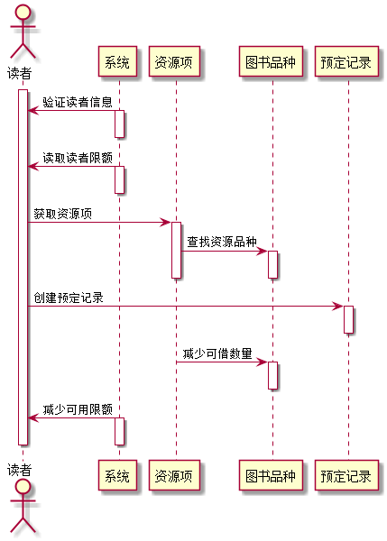
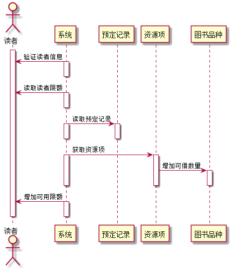
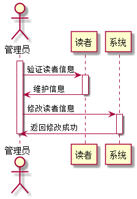
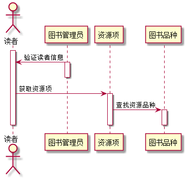
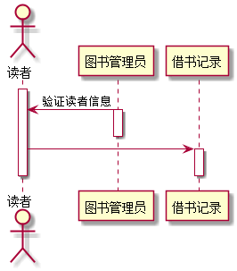
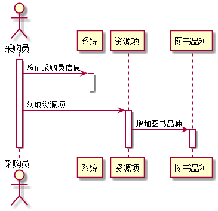
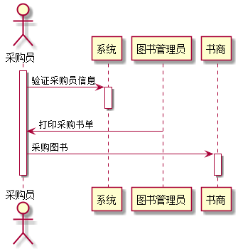
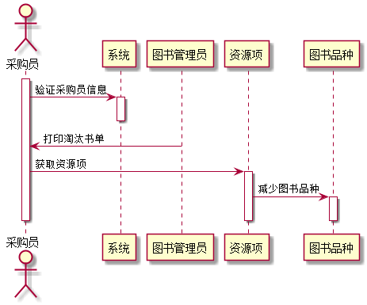

# 图书管理系统的顺序图

## 1. 借书用例
## 1.1. 借书用例PlantUML源码

``` sequence
@startuml
actor 图书管理员
activate 图书管理员
图书管理员 -> 读者: 验证读者信息
activate 读者
deactivate 读者
图书管理员 -> 读者: 读取读者限额
activate 读者
deactivate 读者
loop 1000 times
图书管理员 -> 资源项: 获取资源项
activate 资源项
资源项 -> 图书品种: 查找资源品种
activate 图书品种
deactivate 图书品种
deactivate 资源项
图书管理员 -> 借书记录: 创建借书记录
activate 借书记录
deactivate 借书记录
图书管理员 -> 资源项: 借出资源
activate 资源项
资源项 -> 图书品种: 减少可借数量
activate 图书品种
deactivate 图书品种
deactivate 资源项
图书管理员 -> 读者: 减少可用限额
activate 读者
end
deactivate 读者
图书管理员 -> 借书记录: 打印借书清单
activate 借书记录
deactivate 借书记录
deactivate 图书管理员
@enduml
```

## 1.2. 借书用例顺序图


## 1.3. 借书用例顺序图说明
1. 首先图书管理员验证读者信息，读取读者限额。
2. 图书管理员获取资源项，通过资源项查找资源品种，根据读者所借书目创建借书记录，把书借给读者。
3. 然后图说管理员更改图书可借数量。减少读者可借限额，打印借书清单。

***

## 2. 还书用例
## 2.1. 还书用例PlantUML源码

``` sequence
@startuml
actor 图书管理员
activate 图书管理员
图书管理员 -> 资源项: 读取资源信息
activate 资源项
资源项 -> 借书记录: 取借书记录
activate 借书记录
deactivate 借书记录
资源项 -> 图书品种 : 取图书的品种
activate 图书品种
deactivate 图书品种
deactivate 资源项
图书管理员 -> 读者: 取借阅者信息
activate 读者
deactivate 读者
图书管理员 -> 资源项: 归还资源
activate 资源项
资源项 -> 图书品种: 增加可借数量
activate 图书品种
deactivate 图书品种
deactivate 资源项
图书管理员 -> 借书记录: 登记还书日期
activate 借书记录
deactivate 借书记录
deactivate 图书管理员
@enduml
```

## 2.2. 还书用例顺序图


## 2.3. 还书用例顺序图说明
1. 图书管理员读取资源信息，取得借书记录，然后取得图书品种。
2. 图书管理员取得借阅者信息，通过资源项增加图书可借数量，登记读者还书日期。
***

## 3. 预定图书用例
## 3.1. 预定图书用例PlantUML源码

``` sequence
@startuml
actor 读者
activate 读者
系统 -> 读者: 验证读者信息
activate 系统
deactivate 系统
系统 -> 读者: 读取读者限额
activate 系统
deactivate 系统
读者 -> 资源项: 获取资源项
activate 资源项
资源项 -> 图书品种: 查找资源品种
activate 图书品种
deactivate 图书品种
deactivate 资源项
读者 -> 预定记录: 创建预定记录
activate 预定记录
deactivate 预定记录
资源项 -> 图书品种: 减少可借数量
activate 图书品种
deactivate 图书品种
deactivate 资源项
系统-> 读者: 减少可用限额
activate 系统
deactivate 系统
deactivate 读者
@enduml
```

## 3.2. 预定图书用例顺序图


## 3.3. 预定图书用例顺序图说明
1. 读者通过系统验证读者信息，系统读取读者权限。
2. 读者通过资源项查询图书品种，创建预订记录。
3. 后系统通过资源项减少图书可借数量，减少读者可预订图书数量。
***

## 4. 取消预定用例
## 4.1. 取消预定用例PlantUML源码

``` sequence
@startuml
actor 读者
activate 读者
系统 -> 读者: 验证读者信息
activate 系统
deactivate 系统
系统 -> 读者: 读取读者限额
activate 系统
deactivate 系统
系统 -> 预定记录: 读取预定记录
activate 系统
activate 预定记录
deactivate 系统
deactivate 预定记录
系统 -> 资源项: 获取资源项
activate 系统
activate 资源项
资源项 -> 图书品种: 增加可借数量
activate 图书品种
deactivate 图书品种
deactivate 资源项
deactivate 系统
系统-> 读者: 增加可用限额
activate 系统
deactivate 系统
deactivate 读者
@enduml
```

## 4.2. 取消预定用例顺序图


## 4.3. 取消预定用例顺序图说明
1. 读者通过系统验证读者信息，系统读取读者权限。
2. 系统读取预订记录，然后通过获取资源项增加图书可借数量，增加读者可预订限额。
***

## 5. 维护读者信息用例
## 5.1. 维护读者信息用例PlantUML源码

``` sequence
@startuml
actor 管理员
activate 管理员
管理员 -> 读者:验证读者信息
activate 读者
读者 -> 管理员: 维护信息
deactivate 读者
管理员 -> 系统:修改读者信息
activate 系统
系统 -> 管理员:返回修改成功
deactivate 系统
deactivate 管理员
@enduml
```

## 5.2. 维护读者信息用例顺序图


## 5.3. 维护读者信息用例顺序图说明
1. 管理员通过验证读者信息，然后读者对信息进行增删查改。
***


## 6. 查询书目用例
## 6.1. 查询书目用例PlantUML源码

``` sequence
@startuml
actor 读者
activate 读者
图书管理员 -> 读者: 验证读者信息
activate 图书管理员
deactivate 图书管理员
读者 -> 资源项: 获取资源项
activate 资源项
资源项 -> 图书品种: 查找资源品种
activate 图书品种
deactivate 图书品种
deactivate 资源项
deactivate 读者
@enduml
```

## 6.2. 查询书目用例顺序图


## 6.3. 查询书目用例顺序图说明
1. 图书管理员验证读者信息。
2. 然后读者通过资源项查询图书品种。
***

## 7. 查询借阅情况用例
## 7.1. 查询借阅情况用例PlantUML源码

``` sequence
@startuml
actor 读者
activate 读者
图书管理员 -> 读者: 验证读者信息
activate 图书管理员
deactivate 图书管理员
读者 -> 借书记录
activate 借书记录
deactivate 借书记录
deactivate 读者
@enduml
```

## 7.2. 查询借阅情况用例顺序图


## 7.3. 查询借阅情况用例顺序图说明
1. 图书管理员验证读者信息。
2. 然后读者查询借书记录。
***


## 8. 图书入库情况用例
## 8.1. 图书入库用例PlantUML源码

``` sequence
@startuml
actor 采购员
activate 采购员
采购员 -> 系统: 验证采购员信息
activate 系统
deactivate 系统
采购员 -> 资源项: 获取资源项
activate 资源项
资源项 -> 图书品种: 增加图书品种
activate 图书品种
deactivate 图书品种
deactivate 资源项
deactivate 采购员
@enduml
```

## 8.2. 图书入库用例顺序图


## 8.3. 图书入库用例顺序图说明
1. 采购员通过系统验证信息。
2. 采购员通过资源项增加图书品种，把图书搬入仓库。
***


## 9. 采购图书情况用例
## 9.1. 采购图书用例PlantUML源码

``` sequence
@startuml
actor 采购员
activate 采购员
采购员 -> 系统: 验证采购员信息
activate 系统
deactivate 系统
图书管理员 -> 采购员: 打印采购书单
采购员 -> 书商: 采购图书
activate 书商
deactivate 书商
deactivate 采购员
@enduml
```

## 9.2. 采购图书用例顺序图


## 9.3. 采购图书用例顺序图说明
1. 采购员首先验证自身信息，从图书管理员处得到采购书单
2. 采购员从书商处采购图书。
***

## 10. 淘汰图书情况用例
## 10.1. 淘汰图书用例PlantUML源码

``` sequence
@startuml
actor 采购员
activate 采购员
采购员 -> 系统: 验证采购员信息
activate 系统
deactivate 系统
图书管理员 -> 采购员: 打印淘汰书单
采购员 -> 资源项: 获取资源项
activate 资源项
资源项 -> 图书品种: 减少图书品种
activate 图书品种
deactivate 图书品种
deactivate 资源项
deactivate 采购员
@enduml
```

## 10.2. 淘汰图书用例顺序图


## 10.3. 淘汰图书用例顺序图说明
1. 采购员首先验证自身信息，从图书管理员处得到淘汰书单
2. 采购员通过资源项减少图书品种，再把淘汰书目丢弃。
***