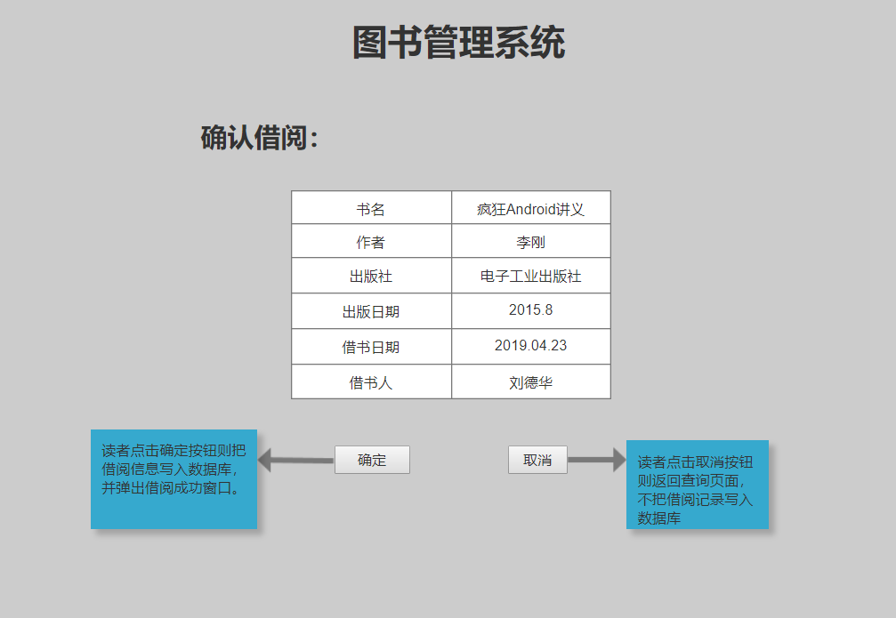

# 实验5：图书管理系统数据库设计与界面设计

## 1.数据库表设计

## 1.1. 图书表
|字段|类型|主键，外键|可以为空|默认值|约束|说明|
|:-------:|:-------------:|:------:|:----:|:---:|:----:|:-----|
|ISBN|varchar2(100)|主键|否|||书号|
|Name|varchar2(100)| |否|||书名|
|Author|varchar2(100)| |否|||作者|
|Publisher|varchar2(100)| |否|||出版社|
|Date|date| |否|||出版日期|
|Sum|varchar2(100)| |否|||库存|
|Num|varchar2(100)| |否|||可借数量|

## 1.2. 读者表
|字段|类型|主键，外键|可以为空|默认值|约束|说明|
|:-------:|:-------------:|:------:|:----:|:---:|:----:|:-----|
|Id|int(20)|主键|否|||借书卡号|
|Name|varchar2(100)| |否|||姓名|
|IdCard|varchar2(13)| |否|||身份证号|
|Tel|int(11)| |是|||电话|
|Quota|varchar2(13)| |否|||可借额度|
|Num|varchar2(13)| |否|||已借数量|

## 1.3. 图书管理员表
|字段|类型|主键，外键|可以为空|默认值|约束|说明|
|:-------:|:-------------:|:------:|:----:|:---:|:----:|:-----|
|Id|int(20)|主键|否|||职工号|
|Name|varchar2(100)| |否|||姓名|
|IdCard|varchar2(13)| |否|||身份证号|
|Tel|int(11)| |是|||电话|

## 1.4. 采购员表
|字段|类型|主键，外键|可以为空|默认值|约束|说明|
|:-------:|:-------------:|:------:|:----:|:---:|:----:|:-----|
|Id|int(20)|主键|否|||职工号|
|Name|varchar2(100)| |否|||姓名|
|IdCard|varchar2(13)| |否|||身份证号|
|Tel|int(11)| |是|||电话|

## 1.5. 采购员表
|字段|类型|主键，外键|可以为空|默认值|约束|说明|
|:-------:|:-------------:|:------:|:----:|:---:|:----:|:-----|
|Id|int(20)|主键|否|||职工号|
|Name|varchar2(100)| |否|||姓名|
|IdCard|varchar2(13)| |否|||身份证号|
|Tel|int(11)| |是|||电话|

## 1.6. 借书记录表
|字段|类型|主键，外键|可一级标题以为空|默认值|约束|说明|
|:-------:|:-------------:|:------:|:----:|:---:|:----:|:-----|
|ISBN|int(20)|外键|否|||书号|
|Id|varchar2(100)|外键|否|||借书卡号|
|jieDate|date| |否|||借书日期|
|huanDate|date| |是|||还书日期|

## 1.7. 预定记录表
|字段|类型|主键，外键|可以为空|默认值|约束|说明|
|:-------:|:-------------:|:------:|:----:|:---:|:----:|:-----|
|ISBN|int(20)|外键|否|||书号|
|Id|varchar2(100)|外键|否|||借书卡号|
|YuDate|date| |否|||预定日期|
|QuDate|date| |是|||取书日期|


## 1.8. 图书管理记录表
|字段|类型|主键，外键|可以为空|默认值|约束|说明|
|:-------:|:-------------:|:------:|:----:|:---:|:----:|:-----|
|ISBN|int(20)|外键|否|||书号|
|Id|varchar2(100)|外键|否|||借书卡号|
|Id1|varchar2(100)|外键|否|||图书管理员职工号|
|Id2|varchar2(100)|外键|否|||采购员职工号|
|Date|date| |否|||图书整理日期|
|CaigouDate|date| |否|||采购日期|
|RukuDate|date| |否|||入库日期|

***

## 2. 界面设计
## 2.1. 借书界面设计
；
；


<a href="ui">UI文件夹<a>
- 用例图参见：借书用例
- 类图参见：借书类，读者类，图书类
- 顺序图参见：借书顺序图
- API接口如下：

1. 查询图书API

- 功能：根据读者输入查询图书
- 请求地址： http://page1/v1/api/shop_cate
- 请求方法：POST
- 请求参数：

|参数名称|必填|说明|
|:-------:|:-------------: | :----------:|
|book_Name|是|用于查询图书信息|
|method|是|固定为 “GET”。|

- 返回实例：
```
{
    "info": "查询成功！",
    "data": {
        "ISBN": "08250411",
        "Name": "疯狂Android讲义",
        "Author": "李刚",
        "Publisher": "电子工业出版社",
        "Date": "2015.8",
        "Sum": "20",
        "Num": "15",
    },
}
```
- 返回参数说明：
    
|参数名称|说明|
|:-------:|:-------------: |
|data|图书信息|

2. 借阅图书API
- 功能：用于读者借阅图书
- 请求地址： http://page2/v1/api/shop_cate
- 请求方法：POST
- 请求参数：

|参数名称|必填|说明|
|:-------:|:-------------: | :----------:|
|book_ISBN|是|获取图书信息，写入借阅记录|
|user_id|是|获取读者信息，写入借阅记录|
|method|是|固定为 “GET”。|

- 返回实例：
```
{
    "info": "借阅成功",
    "data": {
        "ISBN": "书号",
        "Id": "读者借书号",
        "jieDate": "借书日期",
    },
}
```
- 返回参数说明：
    
|参数名称|说明|
|:-------:|:-------------: |
|Info|返回信息|
|ISBN|书号|
|Id|读者借书号|
|jieDate|借书日期|

 