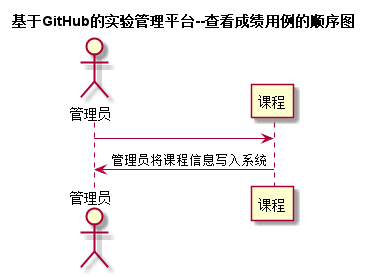

# “添加课程”用例 [返回](../README.md)
## 1. 用例规约

|用例名称|添加课程|
|-------|:-------------|
|功能|管理员将课程录入系统|
|参与者|管理员|
|前置条件|管理员需要先登录|
|后置条件| |
|主事件流| |
|备选事件流| |

## 2. 业务流程（顺序图） [源码](../src/添加课程用例.puml)
 

## 3. 界面设计
- 界面参照: https://15882504801.github.io/qimo/ui/添加课程.html
- API接口调用
    - 接口1：[addCourse](../接口/addCourse.md) 

## 4. 算法描述
    无
    
## 5. 参照表
- [COURSES](../数据库设计.md/#COURSES)
- [TEACHERS](../数据库设计.md/#TEACHERS)
