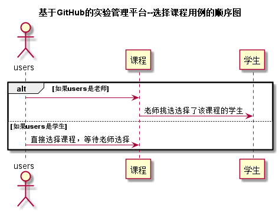

# “选择课程”用例 [返回](../README.md)
## 1. 用例规约

|用例名称|选择课程|
|-------|:-------------|
|功能|选择选择已有课程，然后老师再选择学生，完成选课|
|参与者|学生，老师|
|前置条件|学生，老师需要先登录|
|后置条件|学生的课程列表中有选择的课程 |
|主事件流|1.学生登陆进入选课页面 2.学生选择课程并提交 3.老师登陆进入选课页面，选择自己所教的课程 4.老师挑选选择了该课程的学生|
|备选事件流| 4a.学生的课程列表无选择的课程 1.老师未选择该学生，学生选课失败|

## 2. 业务流程（顺序图） [源码](../src/选择课程用例.puml)
 

## 3. 界面设计
- 界面参照: https://zwdbox.github.io/is_analysis/test6/ui/index.html
- API接口调用
    - 接口1：[selectCoursess](../接口/selectCourses.md) 

## 4. 算法描述

无
    
## 5. 参照表

- [STUDENTS](../数据库设计.md/#STUDENTS)
- [TEACHERS](../数据库设计.md/#TEACHERS)
- [COURSES](../数据库设计.md/#COURSES)